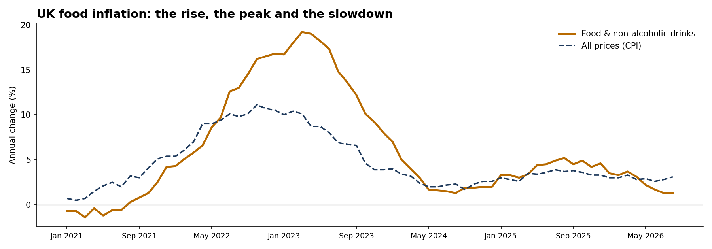
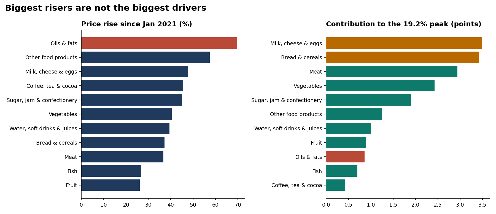

# UK Food Price Tracker, 2021–2026

**Which foods really drove the UK's food price rise, and what does it mean for a food retailer?**

🖥️ **[Live interactive dashboard](https://combatant94.github.io/uk-food-price-tracker/dashboard/)** · 📄 [One-page summary (PDF)](reports/UK_Food_Price_Tracker_Summary.pdf) · 📓 [Step-by-step walkthrough](notebooks/01_walkthrough.ipynb) · 👤 [Portfolio](https://combatant94.github.io/)

New to the project? Start with the [project guide](PROJECT_GUIDE.md).

An end-to-end analysis of official ONS price data: monthly price indices for every food category (January 2021 to Aug 2026) and **75,858 shop-level food price quotes** from January 2021 and January 2025. Every headline number is checked against a published ONS figure.



## Key findings

- **Food prices are up 39.8% since January 2021**, against 31.7% for prices overall. Food inflation peaked at **19.2% in Mar 2023** and is now **1.3%** (Aug 2026), below overall inflation (3.1%).
- **The biggest risers were not the biggest drivers.** Oils and fats rose the most (+69.7%), but contributed only 0.86 points to the 19.2% peak, because households spend relatively little on them. **Milk, cheese & eggs and bread & cereals together contributed 6.9 points.**
- **Like-for-like, the typical product rose 33.4%** from January 2021 to January 2025, close to the official ONS food figure of 34.4% for the same months. Biggest risers: olive oil (+112%), whole sponge cake (+91%) and chocolate-covered ice cream (+87%). Smallest: honey (+1%), instant mashed potato (+1%) and raspberries (+2%).
- **Every region felt it.** On the same 138 products priced in all 12 regions, rises ranged from 29.4% (South East) to 35.2% (London), so the squeeze was national.
- **Chains rose faster than independents** (30.6% vs 15.6% on 39 products), narrowing independents' price premium from 53.0% to 39.1%. This rests on only 753 independent-shop matches, so treat it as a lead rather than a firm finding.



## What it means for a food retailer

1. **Staples set the price perception.** Dairy and bakery drove the most inflation, so pricing on everyday lines matters more than headline rises in smaller categories.
2. **The pressure has eased.** With food inflation now below overall inflation, the focus shifts from price rises to value and quality.
3. **Watch the volatile categories.** Oils and fats, dairy, and other food products such as sauces and condiments swung the most, with annual rises peaking above 30%, so they need the closest cost and promotion monitoring.
4. **National, not regional.** Rises were similar across the UK, supporting consistent national pricing.

## How it was done

| Step | What I did |
|---|---|
| Category trends | Read the ONS MM23 time series and extracted the CPI index and annual weight for each of the 11 food and soft drink categories. |
| Contribution analysis | Contribution = category weight ÷ food weight × category annual rate, using each year's official weights. This separates *what rose most* from *what moved the total*. |
| Like-for-like prices | Matched the **same product in the same shop and region** in January 2021 and January 2025 (21,766 pairs), then took the geometric mean of the price changes for each product. |
| Regions & shop types | Compared change on a fixed basket of products priced in every region, and on products sold in both chains and independent shops. |
| SQL layer | The matching and regional analysis are also written in SQL (MySQL syntax) in `sql/food_price_analysis.sql`. |

### Why like-for-like matters

Comparing the median price of all shops in each year mixes up price change with changes in *which shops and products were sampled*. On that naive basis a whole sponge cake rose 218.2% and honey fell 23.4%. Matched to the same shops, the real changes were **+91.0%** and **+1.1%**. The dashboard lets you switch between the two views.

## How it was checked

- **Contributions reconcile with the official food rate** to within 0.07 percentage points on average, January 2021 onwards.
- **The like-for-like estimate (33.4%) is close to the official ONS food change (34.4%)** for the same period, which shows the matching measures genuine price change.
- **SQL and Python were run side by side** and agree to within 0.05 points per product and exactly by region. That cross-check exposed one centrally collected price, copied into all 12 regions with an exact 5× jump (a pack or product change), which is now excluded by a consistent rule in both layers.

## Limitations

- Price quotes are ONS research data, **not accredited official statistics**.
- ONS stopped publishing individual food price quotes in 2026 after moving groceries to supermarket scanner data, so **January 2025 is the last full like-for-like snapshot**. The category trends run to Aug 2026.
- Contributions use an approximation (fixed annual weights), which reconciles closely but not exactly with ONS's chain-linked method.
- ONS product definitions allow some size ranges (e.g. 500ml–1 litre), so a few products may include pack-size effects. Matches with more than a 5× change, or less than a fifth of the original price, are excluded.

## Repository structure

```
├── README.md                      # this page
├── PROJECT_GUIDE.md               # plain-English guide to every file and step
├── notebooks/01_walkthrough.ipynb # the full analysis, step by step, with explanations
├── src/food_price_pipeline.py     # the final pipeline: reads ONS files, writes all outputs
├── sql/food_price_analysis.sql    # schema, cleaning view, matched pairs, product and regional queries
├── dashboard/index.html           # interactive dashboard (self-contained)
├── reports/
│   ├── UK_Food_Price_Tracker_Summary.pdf   # one-page summary
│   ├── figures/                   # charts used in this README
│   ├── category_cumulative_change.csv
│   ├── item_price_change_matched.csv
│   ├── regional_change.csv
│   └── dashboard_data.json
├── data/                          # place the three ONS files here (not committed: see below)
└── requirements.txt
```

## Run it yourself

1. Download into `data/`:
   - [`mm23.csv`](https://www.ons.gov.uk/economy/inflationandpriceindices/datasets/consumerpriceindices): Consumer price inflation time series
   - [`upload-pricequotes202101.csv`](https://www.ons.gov.uk/file?uri=/economy/inflationandpriceindices/datasets/consumerpriceindicescpiandretailpricesindexrpiitemindicesandpricequotes/pricequotesjanuary2021/upload-pricequotes202101.csv): Price quotes, January 2021
   - [`upload-pricequotes202501.csv`](https://www.ons.gov.uk/file?uri=/economy/inflationandpriceindices/datasets/consumerpriceindicescpiandretailpricesindexrpiitemindicesandpricequotes/pricequotesjanuary2025/upload-pricequotes202501.csv): Price quotes, January 2025
2. `pip install -r requirements.txt`
3. Open `notebooks/01_walkthrough.ipynb` and run it top to bottom, or run `python src/food_price_pipeline.py` to rebuild every output.

## Data source

Office for National Statistics: consumer price inflation time series (MM23) and CPI consumption segment indices and price quotes. Contains public sector information licensed under the Open Government Licence v3.0.

---
**Author:** Mohd Nafees · MSc Data Science (Merit), Birkbeck, University of London · [LinkedIn](https://www.linkedin.com/in/nafees-mohd-59863524b/) · [Portfolio](https://combatant94.github.io/)
